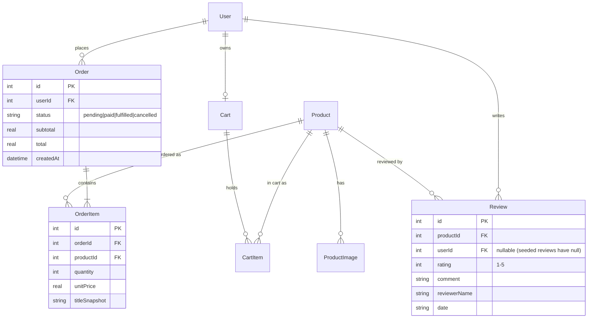

# feat: Harness Engineering Workshop

## Summary

Build a **self-contained, agent-agnostic** workshop that teaches *harness engineering* — the
context files, custom agents, skills/commands, MCP/tooling, quality gates, and interactive
design loop that make an AI coding agent productive on a real codebase. It must run equally
well in **Codex** (the delivery audience's standard) and **Claude Code**.

The harness is authored **once** in `workshop-harness/` and **generated** into both tools'
config by a small build script. The teaching vehicle is a **larger React + NestJS + SQLite
e-commerce platform** with prebuilt Checkout/Orders, Reviews, and Search/recommendations
(all tested); the **Admin Dashboard** is the feature participants build live across four
half-day modules.

This plan is **harness-first** (the agnostic tooling is demoable before the app is finished),
then app foundation, then vertical feature slices, then the quality gate, then curriculum.

> Origin decisions carried forward from the brainstorm (see brainstorm:
> `docs/brainstorms/2026-06-21-harness-engineering-workshop-brainstorm.md`) and grounded in
> the design discussion (see design: `docs/designs/2026-06-21-harness-engineering-workshop-design.md`).

## Goals & Non-Goals

**Goals**
- One source of truth → working `workshop:*` skills + agents + MCP in **both** Codex and Claude.
- A larger e-commerce app with three prebuilt, tested features and a seeded order history.
- A worktree-free quality gate with **advisory** risk levels and finding classification.
- Enforced, maintained unit + e2e tests (Jest / Vitest+RTL / Playwright CLI).
- A half-day, 4-module curriculum culminating in building the Admin Dashboard.

**Non-Goals (YAGNI)** — multi-vendor/marketplace, real payment processor, real-time inventory
(WebSocket), the official plugin's full 32-agent catalog, private SHT telemetry MCP, Playwright
**MCP**/Figma MCP/`agent-browser`, and git-worktree-based gating (kept only as an optional demo).

---

## Architecture Overview

### Repo layout (monorepo, npm workspaces)

```
ai-workshop/
  workshop-harness/                 # SINGLE SOURCE OF TRUTH (edit here)
    harness.config.json             # namespace, manifest of skills/agents/mcp, tool versions
    context.md                      # base conventions -> CLAUDE.md + AGENTS.md
    skills/<name>/SKILL.md (+refs)  # plan|work|review|storm|setup
    agents/<category>/<name>.md     # workers / reviewers / research (MD+YAML source)
    mcp.json                        # MCP server list (source of truth)
  scripts/build-harness.mjs         # generator (Module-3 teaching artifact)

  # GENERATED (committed; regenerate via `npm run build:harness`)
  .claude-plugin/marketplace.json   # local marketplace -> plugins/workshop
  plugins/workshop/                 # Claude plugin: skills/, agents/, .mcp.json, plugin.json, CLAUDE.md
  CLAUDE.md                         # = context.md
  AGENTS.md                         # = context.md + Codex tool directives (Playwright CLI etc.)
  .agents/skills/<name>/            # Codex skills (copied) + playwright-cli mirror
  .codex/agents/<name>.toml         # Codex subagents (transformed from MD+YAML)
  .codex/config.toml                # Codex MCP servers (transformed from mcp.json)
  workshop.local.md                 # written by workshop:setup (agent dispatch config)

  apps/api/                         # NestJS (ported) + orders, reviews-write, search/reco, admin
  apps/web/                         # React + Vite + Tailwind storefront + admin
  e2e/                              # Playwright CLI end-to-end flows
  docs/                             # brainstorms / designs / plans / specs / workshop/
  README.md                         # dual setup: Codex AND Claude
```

### The generator (single source → two targets)

`scripts/build-harness.mjs` reads `workshop-harness/` and emits both tool configs. The
**convergence** of Claude and Codex on the Agent Skills `SKILL.md` standard keeps it thin:

| Source | Claude target | Codex target | Operation |
|---|---|---|---|
| `context.md` | `CLAUDE.md` | `AGENTS.md` (+ Codex tool directives) | copy (+append) |
| `skills/<n>/SKILL.md` (+refs) | `plugins/workshop/skills/<n>/` | `.agents/skills/<n>/` | copy to two dirs |
| `agents/<cat>/<n>.md` (MD+YAML) | `plugins/workshop/agents/<cat>/<n>.md` | `.codex/agents/<n>.toml` | copy + **transform** |
| `mcp.json` | `plugins/workshop/.mcp.json` | `.codex/config.toml [mcp_servers.*]` | emit JSON + **transform TOML** |
| `harness.config.json` | `plugins/workshop/.claude-plugin/plugin.json` + root `marketplace.json` | (drives all above) | derive |

Only **agents** (MD+YAML → TOML: `description`→`description`, body→`developer_instructions`,
`model`→`model`; drop Claude-only `tools`/`isolation`/`maxTurns` with a logged warning) and
**MCP** (JSON→TOML) are true transforms. The script ends with a **smoke check** (every
emitted `.codex/*.toml` parses; `.mcp.json` is valid; skill dir names resolve; Codex
`.agents/skills` path matches the installed Codex version).

---

## Data Design Decisions

Per the planning convention, every enum-like field gets an explicit decision:

- **`Order.status`** → **code enum** (TS union `'pending' | 'paid' | 'fulfilled' | 'cancelled'`).
  Rationale: fixed lifecycle, no runtime editing needed; a workshop favors simplicity over a
  DB lookup table. (Documented so it's a teachable decision, not an accident.)
- **`Product.availabilityStatus`** → stays **computed** (`In Stock`/`Low Stock`/`Out of Stock`)
  from `stock`/`availableStock`, as in the existing API. Not persisted-as-enum.
- **`Review.rating`** → integer 1–5 (validated), not an enum/lookup.
- **Cart reservation TTL** → resolve the documented spec/impl drift explicitly: keep the
  implementation's `reservedAt` + **computed `expiresAt`** model; standardize the TTL constant
  and note it in the spec (do **not** silently diverge). (see design: Decision 9.)

### ERD (new / changed entities)



Existing entities (`User`, `Product`, `ProductImage`, `Cart`, `CartItem`) are reused verbatim
from `/tmp/ai-workshop-final/apps/api` and registered with `synchronize: true` (no migrations).

---

## Implementation Phases

Each phase is a **vertical slice** with its own testing checkpoint. Phases are ordered
harness-first so the agnostic tooling is demoable as early as possible.

### Arc A — Harness Foundation

#### Phase 1 — Monorepo + generator MVP (prove the agnostic pipeline)
**Scope:** Stand up the workspace and `workshop-harness/` with the **smallest end-to-end slice**
— one context file, one skill, one agent, one MCP entry — and a working `build-harness.mjs`
that generates both targets.
**Files:**
- `package.json` (workspaces `apps/*`, root scripts incl. `build:harness`), `.gitignore`
- `workshop-harness/harness.config.json`, `workshop-harness/context.md`
- `workshop-harness/skills/storm/SKILL.md` (minimal, `name: workshop:storm`)
- `workshop-harness/agents/research/repo-research-analyst.md`
- `workshop-harness/mcp.json` (start empty `{}` or a trivial example)
- `scripts/build-harness.mjs` (copy + transform + smoke check)
- Generated (committed): `CLAUDE.md`, `AGENTS.md`, `plugins/workshop/**`,
  `.claude-plugin/marketplace.json`, `.agents/skills/**`, `.codex/agents/*.toml`,
  `.codex/config.toml`
**Steps:** implement copy ops → MD→TOML agent transform → JSON→TOML MCP transform → smoke check.
**Tests / checkpoint:** `npm run build:harness` succeeds; smoke check passes; `workshop:storm`
is invocable in **Claude** (after `/plugin marketplace add .` + install) **and** in **Codex**
(`.agents/skills/storm` discovered). _This phase proves the whole agnostic story._

#### Phase 2 — Full harness port (all skills + agents)
**Scope:** Port the complete `workshop:*` skill set and the focused agent roster from
`/tmp/sht-cc-plugin`, applying the port map: **strip** `start_sht_*` telemetry + private
`.mcp.json` server; **remove** git-worktree dependence; **rename** `sht:`→`workshop:` and
`seven-hills.local.md`→`workshop.local.md`; **swap** `agent-browser`/Figma/Playwright-MCP →
Playwright CLI; **keep** lavish-axi verbatim.
**Files (source under `workshop-harness/`):**
- `skills/plan/SKILL.md` + `references/{visual-feedback.md,plan-templates.md,formatting-guide.md,issue-creation.md}`
  (carry lavish-axi loop incl. `--visual`, `LAVISH_AXI_VERSION = 0.1.31`, pre-flight, poll loop,
  graceful degradation, teardown — see design + port map)
- `skills/work/SKILL.md` + `references/{quality-checklist.md,test-requirements.md,commit-and-pr.md}`
  (drop stacked-PR/Graphite; screenshots via Playwright CLI; no worktree)
- `skills/review/SKILL.md` + `references/{review-perspectives.md,todo-creation-guide.md,browser-testing.md}`
  (browser-testing.md rewritten on Playwright CLI; worktree path removed; quality-gate logic added in Phase 9)
- `skills/storm/SKILL.md` (expand from Phase 1 minimal)
- `skills/setup/SKILL.md` (`disable-model-invocation: true`; writes `workshop.local.md`)
- `agents/worker/{node-worker.md,react-worker.md}`,
  `agents/review/{node-reviewer.md,react-reviewer.md,typescript-reviewer.md,test-reviewer.md,code-simplicity-reviewer.md,agent-smith.md,performance-oracle.md}`,
  `agents/research/repo-research-analyst.md`
- `plugins/workshop/CLAUDE.md` (authoring conventions: namespace `workshop:`, Skill Compliance
  Checklist, AskUserQuestion numbered-list fallback; drop the 3-file SHT versioning rule or adapt)
**Tests / checkpoint:** regen is clean; **every** skill resolves in both tools; `workshop:setup`
writes a valid `workshop.local.md`; `workshop:storm`→`workshop:plan` handoff works. Manual
smoke of `workshop:plan --skip-design` producing a plan file.

### Arc B — App Foundation

#### Phase 3 — NestJS API port
**Scope:** Bring `apps/api` over from `/tmp/ai-workshop-final/apps/api` (auth, products, users,
carts) unchanged; get it booting + seeding + green.
**Files:** `apps/api/**` (modules `auth`, `products`, `users`, `carts`), `apps/api/src/main.ts`
(update CORS origin to the React dev port), seed services.
**Tests / checkpoint:** ported Jest specs pass (`auth.service.spec`, `admin.guard.spec`,
`carts.service.spec`, `carts.concurrency.spec`); app boots; DummyJSON product seed runs once.

#### Phase 4 — React scaffold + auth + catalog + cart + e2e wiring
**Scope:** New `apps/web` (Vite + React + TS + React Router + TanStack Query + Tailwind);
login, product grid + detail, cart drawer (consume existing API); wire Playwright CLI.
**Files:** `apps/web/**` (`src/lib/api.ts`, `src/routes/*`, `src/features/{auth,products,cart}/*`,
`src/components/*`, Tailwind config), `apps/web/vite.config.ts` (port + proxy to API 7800),
`apps/api/src/main.ts` CORS, `@playwright/cli` dev-dep, `e2e/` scaffold + `e2e/auth-catalog-cart.e2e`.
**Tests / checkpoint:** Vitest+RTL for login/grid/cart components; Playwright CLI e2e
`login → browse → add to cart` green (snapshot→ref→act; `PLAYWRIGHT_CLI_SESSION`).

### Arc C — Vertical Feature Slices (API + React + tests + e2e each)

#### Phase 5 — Checkout & Orders
**Scope:** Convert a reserved cart into an order. API: `Order`/`OrderItem` entities (+`status`),
`POST /checkout` (validate reservation, create order, decrement `Product.stock`, clear cart),
`GET /orders`, `GET /orders/:id`. React: checkout form → order confirmation → order history.
**Files:** `apps/api/src/modules/orders/**` (entities, controller, service, types, module),
wire into `app.module.ts`; `apps/web/src/features/orders/*`, `src/features/checkout/*`.
**Tests / checkpoint:** Jest — cart→order conversion, stock decrement, empty/expired-cart guard,
idempotency; RTL — checkout form + history; e2e `browse → cart → checkout → history`.

#### Phase 6 — Reviews write-flow
**Scope:** Authenticated review creation with rating aggregation. API: `POST /products/:id/reviews`,
add nullable `Review.userId`, recompute `Product.rating`. React: reviews section on product
detail (read) + write-a-review form.
**Files:** `apps/api/src/modules/products/*` (review create endpoint/service/DTO,
`review.entity.ts` userId), `apps/web/src/features/reviews/*`.
**Tests / checkpoint:** Jest — create review (auth required), rating recompute, validation
(1–5); RTL — reviews list + form; e2e `login → product → write review → see it`.

#### Phase 7 — Search / filter / recommendations
**Scope:** Extend product querying (price/rating/brand/tag filters + sort) and add a
recommendations endpoint. React: faceted search UI + "related products".
**Files:** `apps/api/src/modules/products/*` (query params + `GET /products/:id/related` or
`/recommendations`), `apps/web/src/features/search/*`, related-products component on detail.
**Tests / checkpoint:** Jest — filter/sort/relevance + recommendations; RTL — facets; e2e
`search + filter narrows results`.

#### Phase 8 — Order-history seeding
**Scope:** Generate synthetic order history so the Admin Dashboard has data on day one.
Idempotent (gated on order count), spread across the past N weeks with varied statuses,
products, quantities, for the seeded users. (see design: Decision 9b.)
**Files:** `apps/api/src/modules/orders/order-seed.service.ts` (or extend products seeder),
register `OnModuleInit`.
**Tests / checkpoint:** Jest — seeder is idempotent + produces N orders across date range;
deleting the sqlite re-seeds products **and** orders.

### Arc D — Quality Gate

#### Phase 9 — Worktree-free quality gate + enforced testing
**Scope:** Implement the gate in `workshop:review` (lifted, worktree-free, from the
`no-mistakes` model) and the test enforcement in `workshop:work`.
- **Findings:** each carries `action: no-op | auto-fix | ask-user` (+ `file`, `line`,
  `description`). `auto-fix` applied to the working tree (`git diff HEAD`); `ask-user` batched
  into one human escalation (approve / fix / skip).
- **Advisory risk:** assign `LOW | MED | HIGH` from change surface (auth, data/migrations,
  payments, public API, breadth) with a `risk_rationale` and a suggested human-review action.
  **Never blocks.**
- **Structured PR body:** deterministic `## Intent` / `## Risk Assessment` / `## Testing` /
  `## Findings` sections around one LLM-drafted `## What Changed` summary + a review checklist.
- **Objective gate:** run the test suite; a red suite or coverage drop **fails the run** (the
  one hard gate). Risk review stays advisory.
- `workshop:work` `test-requirements.md` mandates adding/updating tests per change type.
**Files:** `workshop-harness/skills/review/SKILL.md` (+ `references/`), `workshop-harness/skills/work/references/test-requirements.md`; regenerate.
**Tests / checkpoint:** run the gate on a sample diff → emits PR body + risk + classified
findings; a deliberately failing test fails the run; auto-fix findings mutate the tree, ask-user
findings escalate. (Optional: demo worktree isolation via a ported, opt-in `git-worktree` skill.)

### Arc E — Curriculum + Build Feature

#### Phase 10 — Admin Dashboard reference implementation (facilitator answer-key)
**Scope:** A reference build of the live workshop feature: admin aggregation endpoints + React
dashboard with **four** metrics (revenue over time, top products, low-stock table, orders by
status) via Recharts; produced with a lavish-axi mockup as its design artifact.
**Files:** `apps/api/src/modules/admin/**` (aggregation endpoints, admin-guarded),
`apps/web/src/features/admin/dashboard/*`, `docs/designs/<date>-admin-dashboard-mockup.html`.
**Tests / checkpoint:** Jest — aggregation correctness over seeded data; RTL — widgets; e2e —
dashboard renders seeded metrics. Kept clearly labeled as the **reference/answer-key** for the
participant exercise.

#### Phase 11 — Workshop curriculum + dual-tool docs
**Scope:** Author the half-day, 4-module curriculum and the dual setup story.
- **M1 Context & agent files** · **M2 Agents & skills (plan→work→review; build one agent/skill)**
  · **M3 MCP & tools + the generator (Playwright CLI; build-harness)** · **M4 Interactive design
  + quality gate (lavish-axi mockup, advisory risk gate, tests) → build the Admin Dashboard.**
**Files:** `docs/workshop/{00-overview,01-context,02-agents-skills,03-mcp-tools,04-design-gate}.md`,
`docs/workshop/admin-dashboard-exercise.md`, `docs/workshop/facilitator-notes.md`, root `README.md`
(Codex setup **and** Claude `/plugin marketplace add .`; min Codex version; Node ≥ 22 note).
**Tests / checkpoint:** dry-run each module's documented steps in **both** Codex and Claude;
verify the Admin Dashboard exercise is reproducible from a clean clone.

---

## System-Wide Impact

- **CORS / ports:** API stays on 7800; React dev port (e.g. 5173 or 7801) must be added to API
  CORS and the web API base URL.
- **Seeding:** deleting `apps/api/db/workshop.sqlite` now re-seeds **products and orders**.
- **Global config touch:** none by default. `lavish-axi setup hooks` (optional) and the Claude
  marketplace install are the only steps that touch tool-level config; both documented, both opt-in.
- **Generated artifacts are committed:** any harness source change requires `npm run build:harness`
  and committing the regenerated targets (enforce via a `workshop:work` checklist item, optionally
  a CI check).

## Quality Gates

- `npm run build:harness` smoke check green (TOML parses, plugin loads, skills resolve in both tools).
- All Jest + Vitest suites green; Playwright CLI e2e flows green.
- `workshop:review` gate runs clean on the final diff (advisory risk recorded; no unaddressed
  `ask-user` findings; tests pass).
- Each module dry-run reproduces in both Codex and Claude from a clean clone.

## Testing Strategy

(see design: Testing Strategy.) API → Jest (port existing + add orders/reviews/search/admin/seed;
keep the real in-memory better-sqlite3 concurrency spec pattern). Web → Vitest + React Testing
Library. E2E → Playwright CLI flows in `e2e/`. Enforcement → `workshop:work` requires tests per
feature; `workshop:review` runs the suite as the one objective gate.

## Risks & Mitigations

- **Codex `.agents/skills` path drift across versions** → smoke-check the path against the
  installed Codex; pin a minimum version in README. (see design: Resolved Q4.)
- **Playwright CLI skill only auto-installs to `.claude/`** (GH #39317) → generator mirrors to
  `.agents/skills/` + AGENTS.md directive.
- **Scope vs. timeline (full baseline is large)** → harness-first sequencing makes the core
  demoable early; feature slices are independent and can land incrementally.
- **lavish-axi needs Node ≥ 22** → environment is Node 22; graceful text-only fallback retained.
- **Generated-artifact drift** → `build:harness` + commit discipline; optional CI check.

## Acceptance Criteria

- [x] `workshop:plan|work|review|storm|setup` are invocable and functional in **both** Codex and Claude. _(Phase 2 — generated to both targets; runtime dry-run in each tool is part of Phase 11)_
- [x] Editing a file in `workshop-harness/` + `npm run build:harness` updates both targets; smoke check passes. _(Phase 1)_
- [ ] `workshop:plan --visual` runs the lavish-axi loop (Node ≥ 22) and folds back into the design doc; degrades gracefully otherwise.
- [ ] App boots; products + **order history** seeded; login works for `admin@test.com` / `user@test.com` (pwd `password`).
- [ ] Checkout/Orders, Reviews-write, and Search/recommendations are fully functional and tested (Jest + RTL + e2e).
- [ ] `workshop:review` emits an advisory risk level + rationale + classified findings + structured PR body, **without** git worktrees, and fails only on red tests/coverage drop.
- [ ] Playwright CLI drives the e2e suite via npx (no global install).
- [ ] The Admin Dashboard reference renders all four metrics from seeded data.
- [ ] M1–M4 docs + dual-tool README enable a clean-clone attendee to complete the workshop in either tool.

## Out of Scope

Multi-vendor/marketplace, real payments, real-time inventory (WebSocket), full official agent
catalog, Playwright MCP / Figma MCP / `agent-browser`, private SHT telemetry, and worktree-based
gating (optional demo only).

## Sources

- **Brainstorm:** `docs/brainstorms/2026-06-21-harness-engineering-workshop-brainstorm.md` —
  carried forward: single-source→generated targets, `workshop:` namespace, Playwright CLI
  (browser tooling), lavish-axi loop, worktree-free advisory quality gate, enforced tests, full
  baseline + Admin Dashboard as the build feature, half-day/4-module hybrid pedagogy.
- **Design:** `docs/designs/2026-06-21-harness-engineering-workshop-design.md` — architecture,
  generator mapping, data decisions, resolved questions.
- **Reference repos:** `/tmp/sht-cc-plugin` (skill/agent/plugin structure + lavish-axi +
  port map), `/tmp/ai-workshop-final` (NestJS API, entities, seed, auth, cart reservation),
  `/tmp/lavish-axi-clone`, `/tmp/no-mistakes-clone` (finding model + PR-body assembly).
- **External docs:** Codex (AGENTS.md, skills `.agents/skills`, subagents TOML, MCP `config.toml`),
  Claude Code (plugins/skills/agents/.mcp.json), `@playwright/cli` (`install --skills`, refs),
  `lavish-axi` 0.1.31.
